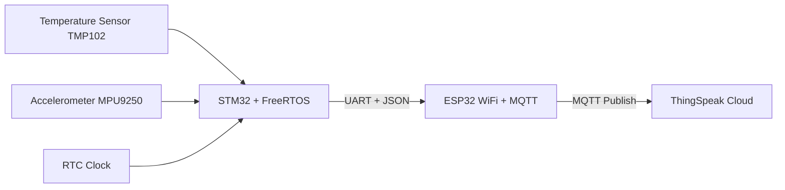

# SensorNode Project

##  Overview

This project implements a professional IoT sensor node using **STM32 (FreeRTOS)** and **ESP32** as an MQTT gateway.
The STM32 collects data from sensors, applies filtering and calibration, and sends the results as **JSON over UART**.
The ESP32 publishes the JSON to **ThingSpeak (MQTT)** for cloud visualization.

---

##  Features

* TMP102 temperature sensor
* MPU9250 accelerometer (X-axis)
* RTC (real-time clock) timestamp
* Filtering: **Moving Average (temperature)**, **Exponential Moving Average (accelerometer)**
* JSON serialization
* FreeRTOS tasks & queues
* ESP32 MQTT client for ThingSpeak

---

##  System Architecture



---

##  Project Structure

```plaintext
project-root/
│
├── CMakeLists.txt           # Main CMake file
├── Core/
│   ├── Inc/                 # main.h, FreeRTOSConfig.h, etc.
│   └── Src/                 # main.c
├── Drivers/
│   ├── TMP102/              # tmp102.c/.h
│   ├── MPU9250/             # mpu9250.c/.h
│   ├── RTC/                 # rtc.c/.h
│   └── Filter/              # filter.c/.h
├── App/
│   ├── packet.c/.h
│   └── packet_test.c
├── FreeRTOS/
│   ├── CMSIS_RTOS/ ...
│   └── Source/ ...
├── startup/
│   └── startup_stm32fxxx.s
└── linker/
    └── STM32Fxxx_FLASH.ld
```

---

##  Build

```bash
git clone https://github.com/yourusername/SensorNode.git
cd SensorNode
mkdir build && cd build
cmake .. -G "Ninja"
ninja
```

---

##  Flashing

**Using OpenOCD**

```bash
openocd -f interface/stlink.cfg -f target/stm32f4x.cfg \
        -c "program build/SensorNode.elf verify reset exit"
```

**Using STM32CubeProgrammer**

```bash
STM32_Programmer_CLI -c port=SWD -w build/SensorNode.hex
```

---

##  ThingSpeak Visualization

The ESP32 sends JSON data to ThingSpeak every 15 seconds.

**Example JSON from STM32:**

```json
{
  "temperature": 20.94,
  "acceleration_x": -0.050,
  "timestamp_ms": 1079373,
  "timestamp_date": "2025-10-14 10:33:00"
}
```

**ThingSpeak fields:**

* Field 1 → Temperature (°C)
* Field 2 → Acceleration X (g)
* Field 3 → Timestamp (optional)

---

##  ESP32 MQTT Client

The ESP32 receives JSON data from STM32 via UART and publishes it to **ThingSpeak MQTT**.

### Features

* Reads UART2 (GPIO16 = RX, GPIO17 = TX)
* Parses JSON using ArduinoJson
* Publishes to ThingSpeak every 15 seconds
* Handles WiFi + MQTT reconnect (via `client.loop()`)

### Example `main.ino`

```cpp
#include <WiFi.h>
#include <PubSubClient.h>
#include <ArduinoJson.h>

// WiFi credentials
const char* ssid = "MyWiFi";
const char* password = "MyPassword";

// ThingSpeak MQTT
const char* mqttServer = "mqtt3.thingspeak.com";
const int mqttPort = 1883;
const char* mqttUser = "YOUR_USER";
const char* mqttPassword = "YOUR_PASS";
const char* mqttClientID = "YOUR_ID";
const char* publishTopic = "channels/XXXXXX/publish";

WiFiClient espClient;
PubSubClient client(espClient);

String lineBuffer;
unsigned long lastSend = 0;

void setup() {
  Serial.begin(115200);
  Serial2.begin(115200, SERIAL_8N1, 16, 17);

  WiFi.begin(ssid, password);
  while (WiFi.status() != WL_CONNECTED) delay(500);

  client.setServer(mqttServer, mqttPort);
  while (!client.connected()) {
    client.connect(mqttClientID, mqttUser, mqttPassword);
  }
}

void loop() {
  while (Serial2.available()) {
    char c = Serial2.read();
    if (c == '\n') {
      StaticJsonDocument<256> doc;
      if (!deserializeJson(doc, lineBuffer)) {
        float temperature = doc["temperature"];
        float acc_x = doc["acceleration_x"];
        if (lastSend == 0 || millis() - lastSend > 16000) {
          String payload = String("api_key=YOUR_API_KEY");
          payload += "&field1=" + String(temperature, 2);
          payload += "&field2=" + String(acc_x, 3);
          client.publish(publishTopic, payload.c_str());
          lastSend = millis();
        }
      }
      lineBuffer = "";
    } else if (c != '\r') {
      lineBuffer += c;
    }
  }
  client.loop(); // keep MQTT connection alive
}
```

---

## 👤 Author

Developed by **Ramazan YÜCEL**

* 💻 [GitHub](https://github.com/ramazan2765)
* 🔗 [LinkedIn](https://www.linkedin.com/in/ramazanyucel)

---

##  License

This project is licensed under the **MIT License** – see the [LICENSE](LICENSE) file for details.

