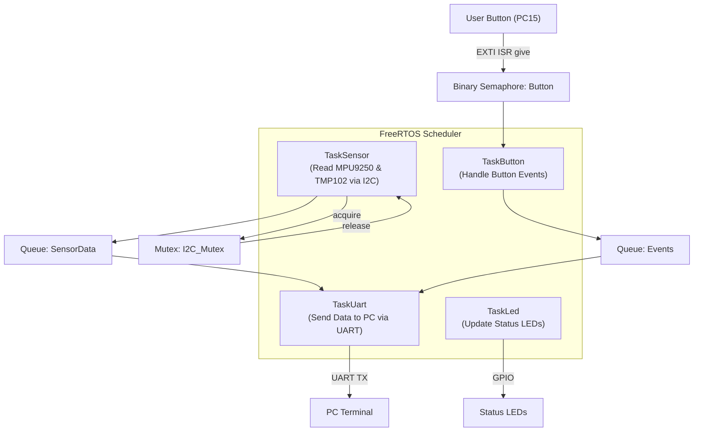

# STM32F411 FreeRTOS Multitask Demo

## Project Overview
This project demonstrates **real-time multitasking** on the STM32F411 microcontroller using **FreeRTOS**.  
The application showcases the integration of multiple concurrent tasks:
- Sensor data acquisition (MPU9250 + TMP102 via I2C)
- User button interrupt handling
- Data logging over UART to PC
- System state indication through onboard LEDs  

The purpose is to highlight how FreeRTOS primitives such as the **task scheduler, queues, mutexes, and binary semaphores** can be used in an embedded environment.

---

## Hardware
- **MCU**: STM32F411CEU6 (48-pin, e.g., Black Pill board)  
- **Sensors**:  
  - MPU9250 (Accelerometer + Gyroscope, I2C)  
  - TMP102 (Temperature sensor, I2C)  
- **User Button**: PC15 (external interrupt)  
- **Status LEDs**: PA1, PA2, PA3 (GPIO outputs)  
- **UART**: USART1 (PA9/PA10 → USB-TTL adapter or ST-Link VCP)  
- **Pull-up resistors**: 4.7kΩ for I2C SCL/SDA (if not already included on the sensor modules)  

---

## Pin Mapping

| Peripheral   | Pin(s) | Description                  |
|--------------|--------|------------------------------|
| **I2C1_SCL** | PB8    | Sensor I2C Clock             |
| **I2C1_SDA** | PB9    | Sensor I2C Data              |
| **USART1_TX**| PA9    | UART transmit to PC          |
| **USART1_RX**| PA10   | UART receive from PC         |
| **LED1**     | PA1    | Status LED (Green)           |
| **LED2**     | PA2    | Status LED (Orange)          |
| **LED3**     | PA3    | Status LED (Red)             |
| **User Button** | PC15| External button (EXTI input) |

---

## System Architecture

Tasks
TaskSensor

Priority: osPriorityHigh

Period: 50 ms (20 Hz)

Function: Reads MPU9250 and TMP102 sensors sequentially

Shared resource: I2C_Mutex

Output: Queue_SensorData

Struct: { accel, gyro, temp, ts }

TaskButton

Priority: osPriorityAboveNormal

Trigger: BinarySemaphore_Button (EXTI ISR give)

Function:

Counts button presses / increments counter

Handles “mode toggle”

Sends result to Queue_Events

TaskUart

Priority: osPriorityNormal

Input:

Queue_SensorData

Queue_Events

Function: Sends sensor and event data to PC as line-based JSON/CSV logs

TaskLed

Priority: osPriorityLow

Function: Indicates system status via LED

Green: Normal beat

Orange: Button event

Red: Error state

Queues

Queue_SensorData

Length: 10

Item size: Sensor packet struct

Queue_Events

Length: 10

Item size: Event struct (e.g., { type, ts })

Mutexes / Semaphores

I2C_Mutex

Ensures exclusive access to MPU9250 & TMP102

BinarySemaphore_Button

Used for synchronization from ISR to task
